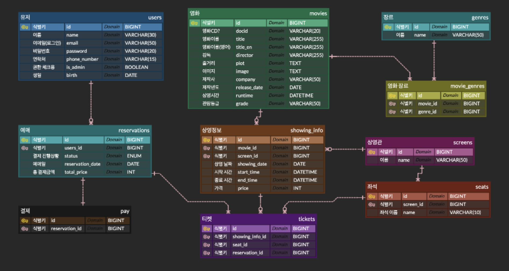

# 🎬 Movie-platform
> Spring Boot 와 MySQL 으로 구현한 영화 플랫폼 서비스 (백엔드)

## 📆 개요

| 항목 | 내용 |
| :---: | :---: |
| 프로젝트 기간 | 2025. ~ 2025.10.27 |
| 개발인원 | 1인 |

## 🧩 시스템 아키텍처

* 클라이언트 요청은 80/443 포트로 진입합니다.
* 이 요청은 서버의 해당 포트와 매핑된 Nginx Proxy Manager(NPM) 컨테이너가 수신합니다.
* NPM은 SSL 인증서를 적용하여 HTTPS로 암호화하고, 리버스 프록시 역할을 수행합니다.
* NPM은 요청 URL을 분석하여 일반 페이지 요청은 프론트엔드 컨테이너로, /api 경로의 요청은 백엔드 컨테이너로 라우팅합니다.
* NPM, 프론트, 백엔드 컨테이너는 모두 동일한 도커 네트워크에 속해 있어, 내부적으로 컨테이너 이름을 통해 서로 통신합니다.

## 🛠️ 기술 스택

* **Backend:**
    * Language: Java
    * Framework: Spring Boot

* **Database:**
    * RDBMS: MySQL

* **Data Access:**
    * ORM / Mapper: Spring Data JPA
    * Query Builder: Query DSL

* **Auth / Security:**
    * Spring Security
    * JWT

* **API:**
    * REST API

* **Build**
    * Build Tool: Maven

* **Deployment:**
    * Infra: AWS EC2, RDS
    * Container: Docker

* **CI/CD:**
    * GitHub Actions

## 🖼️ ERD

## ✨ 주요 기능

**👥 회원관리**
  * 사용자 회원가입 및 로그인 기능
  * (JWT) 토큰 기반 인증
  * 마이페이지 (정보 수정, 예매 내역 확인, 회원 탈퇴)

**🎬 영화관리**
  * 외부 API(KMDB 검색) 사용으로 간편한 영화, 장르 등록
  * 메인페이지 필터링 기능(최신순, 오래된순 등)
  * 영화 상세정보 조회기능
  
**🍿 상영관 / 좌석 관리**
  * 상영관 등록,삭제 기능
  * 상영관별 좌석 생성 및 관리
  * 상영 시간표 등록 및 관리
  
**🎟️ 예매관리**
  * 영화, 극장, 상영 시간 선택 기능
  * 예매 시 상영관별 실시간 좌석 현황 조회
  * 좌석 선택 및 예매 가능/불가능 상태 표시
  * 예매 완료 내역 확인
